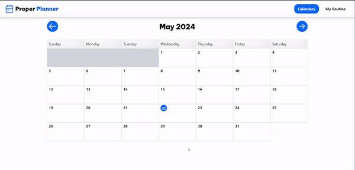

<h1 align="center">
  <br>
  </a>

</h1>

<h4 align="center">A sleek app for storing events in a calendar, allowing you to create and manage daily routines for each day of the week</a>.</h4>

<p align="center">
  <a href="#key-features">Key Features</a> •
  <a href="#how-to-use">How To Use</a> •
  <a href="#built-with">Built With</a> 
</p>

<div align="center">
  <br>
  </a>

</div>

## Key Features

* CRUD Events
* CRUD Routine Activities

## Built With

- ⚡️ **Vite**: Fast and lightweight build tool.
- ⚛️ **React**: JavaScript library for building user interfaces.
- 📦 **TypeScript**: Superset of JavaScript that adds static typing.
- 🎨 **TailwindCSS**: Encapsulated styling by component.

## How To Use

To clone and run this application, you'll need [Git](https://git-scm.com) and [Node.js](https://nodejs.org/en/download/) (which comes with [npm](http://npmjs.com)) installed on your computer. From your command line:

```bash
# Clone this repository
$ git clone https://github.com/JesusVale/Propper-Planner

#Clone and prepare backend repository
$ git clone https://github.com/JesusVale/Propper-Planner-Back

# Install dependencies
$ npm install

# Run the app
$ npm run dev
```